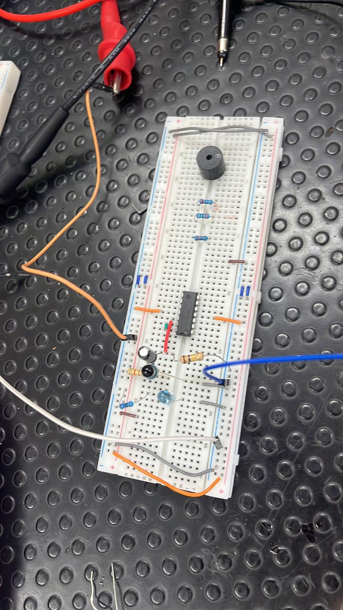

# Medidor de pulso cardiaco

## Descripción

Este proyecto consiste en la construcción de un medidor de pulso cardiaco
basado en un ESP32 Mini, sensores infrarrojos y una etapa de amplificación.

El sistema adquiere la señal asociada al pulso, procesa la información
y permite enviar los datos mediante comunicación MQTT utilizando Mosquitto.

## Objetivo

Diseñar e implementar un sistema electrónico capaz de detectar y transmitir
información relacionada con el pulso cardiaco mediante un microcontrolador
y un sistema de comunicación.

## Componentes principales

- ESP32 Mini.
- Sensores infrarrojos.
- Amplificadores.
- Circuito de acondicionamiento de señal.
- Protoboard y cables de conexión.
- Computador para supervisión y comunicación.

## Tecnologías utilizadas

- Arduino IDE.
- ESP32.
- Comunicación MQTT.
- Mosquitto.
- Sensores infrarrojos.
- Procesamiento de señales.

## Funcionamiento general

El sensor infrarrojo detecta las variaciones producidas por el flujo
sanguíneo. La señal obtenida es acondicionada mediante una etapa de
amplificación y luego procesada por el ESP32 Mini.

Después, los datos pueden ser enviados mediante el protocolo MQTT hacia
un broker Mosquitto para su supervisión o utilización en otra aplicación.

## Evidencia del prototipo

### Montaje en protoboard

## Trabajo en equipo

Este proyecto fue desarrollado en equipo junto con Jorge Andrés Acosta
y Santiago Duque.

## Video de demostración

El video del prototipo funcionando se agregará posteriormente en la sección
[Releases](../../releases) del repositorio.
### Aportes individuales

- **Anderson Lopera Rodríguez:** programación del ESP32 Mini, configuración
  y funcionamiento de la comunicación MQTT, integración del sistema de
  adquisición y diseño 3D del prototipo.

- **Jorge Andrés Acosta:** diseño de la tarjeta de circuito impreso (PCB)
  utilizando Fusion.

- **Santiago Duque:** elaboración del informe técnico del proyecto.

### Trabajo conjunto

Los integrantes del equipo realizamos el montaje del circuito en protoboard,
la integración de los componentes y las pruebas necesarias para verificar
el funcionamiento del prototipo.

El diseño de la PCB y el diseño 3D fueron desarrollados como propuestas de
diseño. La PCB no fue fabricada físicamente y el modelo 3D no llegó a
imprimirse.

## Estado del proyecto

Prototipo académico.

## Aviso

Este proyecto es un prototipo académico desarrollado con fines educativos.
No es un dispositivo médico y no debe utilizarse para diagnóstico, tratamiento
ni toma de decisiones clínicas.
## Mejoras futuras

- Fabricar y probar la PCB diseñada.
- Imprimir el modelo 3D del prototipo.
- Incorporar una interfaz gráfica para visualizar los datos.
- Mejorar la calibración y el filtrado de la señal.
- Agregar almacenamiento histórico de las mediciones.
- Comparar las mediciones con un dispositivo de referencia.

## Autores

- Anderson Lopera Rodríguez
- Jorge Andrés Acosta
- Santiago Duque

Tecnología en Automatización Electrónica  
ITM — Medellín, Colombia
